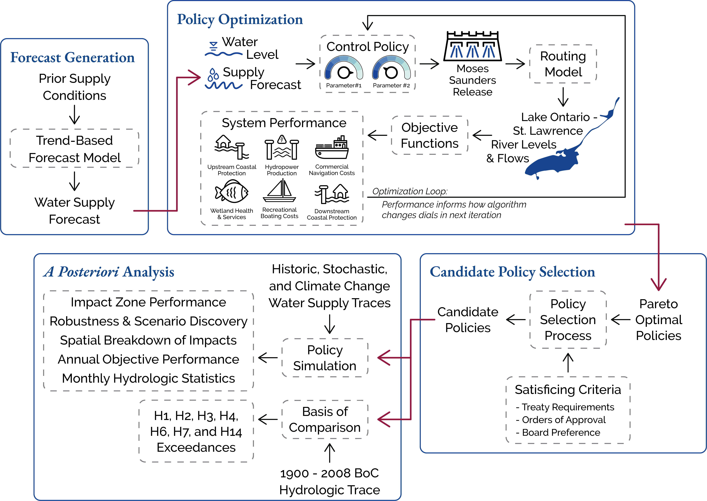

# Optimization of Lake Ontario Flow Regulation

This repo contains code to generate water supply forecasts, optimize flow regulation plans, assess policy performance across plausible future climate conditions, and explore results in an interactive dashboard.

<br>



<br>

# Table of Contents

- [Overview](#overview)
    - [Plan 2014](#plan-2014)
    - [Forecast Generation](#forecast-generation)
    - [Control Policy Optimization](#control-policy-optimization)
    - [Objective Functions](#objective-functions)
- [Getting Started](#getting-started) 
    - [Many-Objective Evolutionary Algorithm](#many-objective-evolutionary-algorithm)
    - [Demo](#demo)
    - [Dashboard](#dashboard)

<br>

# Overview

This section describes the current flow regulation plan of the LOSLR system, key decision variables that are optimized within Plan 2014 to discover new, alternative control policies, and objective functions that measure system performance for alternative control policies.

## Plan 2014

The current control policy, [Plan 2014](resources/Plan_2014_Report.pdf), takes in the current water level of Lake Ontario, $Level_{Ont}$, and a forecasted supply index, $NTS_{fcst}$, and prescribes releases based on a sliding rule curve function and adjusts the rule curve release via embedded flow constraints. 

The forecasted supply index, $NTS_{fcst}$, at any given quarter-month, $q$, is calculated by inputing the rolling average annual net total supply calculated into an autoregressive time series model:

$$ NTS_{prev} = \overline {NTS_{q - 49} : NTS_{q - 1}} $$
$$ NTS_{fcst} = AR_{1}(NTS_{prev}) $$

Confidence intervals, $CI_{50}$ and $CI_{99}$, are applied to the $NTS_{fcst}$ term to calculate upper and lower limits:

$$
NTS_{99} = NTS_{fcst} \pm {CI}_{99}
NTS_{50} = NTS_{fcst} \pm {CI}_{50}
$$

$NTS_{fcst}$, $NTS_{99}$, and $NTS_{50}$  are compared to thresholds of wet and dry supplies, $T_{w}$ and $T_{d}$, to determine if future conditions are wet, average, or dry and confidence in those future conditions.

The sliding rule curve function is based on the pre-project release, $R_{pp}$, conditions, which is calculated using the open-water stage-discharge relationship:

$$ 
R_{pp} = 555.823 * (Level_{Ont} - 0.035 - 69.474)^{1.5} 
$$

The $R_{pp}$ flow amount is adjusted up or down, $A_{w}$ and $A_{d}$, based on recent supply conditions to get the rule curve release, $R_{rc}$, amount:

<!-- $$ 
R_{rc} = \left\{
\begin{array}{ll}
R_{pp} + \displaystyle \left[ \frac {NTS_{fcst} - NTS_{avg}} {NTS_{max} - NTS_{avg}} \right] ^ {P_1} * C_1 & NTS_{fcst} \ge T_{rc} \\
\\
R_{pp} - \displaystyle \left[ \frac {NTS_{avg} - NTS_{fcst}} {NTS_{avg} - NTS_{min}} \right] ^ {P_2} * C_2 & NTS_{fcst} \lt T_{rc} \\
\end{array} 
\right. 
$$ -->

$$ 
R_{rc} = \left\{
\begin{array}{ll}
R_{pp} + A_{w} ^ {P_1} * C_1 & NTS_{fcst} \ge T_{rc} \\
\\
R_{pp} - A_{d} ^ {P_2} * C_2 & NTS_{fcst} \lt T_{rc} \\
\end{array} 
\right. 
\\[15pt]
A_{w} = \displaystyle \left[ \frac {NTS_{fcst} - NTS_{avg}} {NTS_{max} - NTS_{avg}} \right]
A_{d} = \displaystyle \left[ \frac {NTS_{avg} - NTS_{fcst}} {NTS_{avg} - NTS_{min}} \right]
$$


where $NTS_{max}$ is the historical maximum annual average NTS, $NTS_{min}$ is the historical minimum annual average NTS, $NTS_{avg}$ is the historical average annual average NTS the threshold that designates which regime to follow. The historical values in Plan 2014 were calculated from the period of record from 1900 through 2000. 

The multipliers, $C_{1}$ and $C_{2}$, and exponents, $P_{1}$ and $P_{2}$, are sets of constants some of which are determined by comparing the forecasted supply to a threshold of wet conditions, $T_{w}$, and forecast confidence, ${CI}_{99}$. When there is high confidence in wet basin conditions, releases increase by setting $C_{1}$ to $C_{1w}$ from $C_{1m}$:

$$ 
C_{1} = \left\{
\begin{array}{ll}
C_{1w} & NTS_{fcst} - {CI}_{99} \ge T_{w} \\
\\
C_{1m} & otherwise \\
\end{array} 
\right. 
$$

During extremely dry conditions (designated when water levels fall below some threshold, $L_{d}$), the rule curve release is further reduced by $F_{d}$:

$$ 
R_{rc} = \left\{
\begin{array}{ll}
R_{rc} - F_{d} & Level_{Ont} \lt L_{d} \\
\\
R_{rc} & otherwise \\
\end{array} 
\right. 
$$

Between September 1st and December 31, releases are increased if lake levels are dangerously high to reach target level, ${L}_{r}$:

$$ 
R_{rc} = \left\{
\begin{array}{ll}
R_{rc} + \displaystyle \left[ \frac {(Level_{Ont} - {L}_{r}) * 2970} {Q_{e} - q + 1} \right] & Q_{s} \le q \le Q_{e}, Level_{Ont} \gt {L}_{r} \\
\\
R_{rc} & otherwise \\
\end{array} 
\right.
$$

where $Q_{s}$ is the starting quarter-month, September 1 (QM32), and $Q_{e}$ is the ending quarter-month, December 31 (QM48).

The $R_{rc}$ prescribed flow is then checked against a series of flow limits, which are embedded within Plan 2014 to protect various system needs and interests. For example, the I-limit constrains flows during ice formation to prevent an ice jam and the L-limit constrains flows during navigation season to maintain safe velocities for ship navigability. More information on flow limits can be found in the [Plan 2014 Compendium Report](resources/Plan2014_CompendiumReport.pdf).

<br>

## Forecast Generation
The parameters of the AR1 forecast model (first-order autocorrelation coefficient and shift) in Plan 2014 were calibrated using the historical data from 1900 through 2000. Using the same trend-based forecast structure, we create new forecasts at the 1, 3, 6, and 12-month lead-times. For example, rather than averaging the previous 48 quarter-months of water supplies for the 12-month lead time, we average the previous 24 quarter-months of water supplies for the 6-month lead time. We refit the parameters in the AR1 forecast model for each lead-time using historic NTS data from 1900 through 2020. For each forecast lead-time, we create forecasts using the baseline trend-model skill as well as perfect skill (i.e., perfect insight into future conditions).

<br>

## Control Policy Optimization
Given legal and regulatory operating requirement, we optimize key decision variable in the rule curve function and leave the flow limits as is. The optimization currently includes 17 decision variables from the forecasting and rule cruve functions, including:

- Forecast confidence intervals
    - ${CI}_{50}$, ${CI}_{99}$
- Forecast wet and dry thresholds 
    - $T_{w}$, $T_{d}$
- Rule curve coefficients and exponents
    - $C_{1m}$, $C_{1w}$, $C_{2}$, $P_{1}$, $P_{2}$
- Rule curve threshold and flow adjustments
    - $T_{rc}$, $A_{w}$, $A_{d}$
- Rule curve dry period adjustments
    - $L_{d}$, $F_{d}$
- Rule curve high level adjustments
    - ${L}_{r}$, ${Q}_{s}$, and ${Q}_{e}$.

Upper and lower bounds of the decision variables are set to $\pm$ 75% of their current value in Plan 2014.

<br>

## Objective Functions
There are 7 objective functions used to measure policy performance:

1) **Upstream flooding impacts**
    - *Unit:* Number of homes flooded
    - *Timestep:* Quarter-monthly
    - *Location:* Lake Ontario, Alexandria Bay (NY), Cardinal (ON)
2) **Downstream flooding impacts**
    - *Unit:* Number of homes flooded
    - *Timestep:* Quarter-monthly
    - *Location:* Lery-Beauharnois (QC), Pointe-Claire (QC), Maskinonge (QC), Sorel (QC), Lac St. Pierre (QC), Trois-Rivieres (QC)
3) **Commercial navigation costs**
    - *Unit:* USD
    - *Timestep:* Quarter-monthly
    - *Location:* Lake Ontario, the Seaway (Upper St. Lawrence to Montreal), downstream of Montreal
4) **Hydropower production**
    - *Unit:* USD
    - *Timestep:* Quarter-monthly
    - *Location:* Moses-Saunders Dam and Niagara Power Generation Station
5) **Meadow marsh area**
    - *Unit:* Hectares
    - *Timestep:* Annually
    - *Location:* Lake Ontario
6) **Muskrat house density**
    - *Unit:* Dimensionless
    - *Timestep:* Annually
    - *Location:* Thousand Islands Region in the Upper St. Lawrence River (Alexandria Bay, NY)
7) **Recreational boating costs**
    - *Unit:* USD
    - *Timestep:* Quarter-monthly
    - *Location:* Lake Ontario, Alexandria Bay (NY), Brockville (ON), Ogdensburg (NY), Long Sault (ON), Pointe-Claire (QC), Varennes (QC), Sorel (QC)

The **net annual average** values for each objective function are used as the metric to represent overall policy performance. More detail on the model input, output, and formulation is available [here](objectiveFunctions/README.md).

## *A Posteriori* Analysis
Given the computational constraints, only 7 objective functions can be used to optimize control policies. However, there are additional criteria a plan must meet in order to be considered a candidate plan, including:

1) Basis of Comparison (H-Criteria)
2) Impact Zone Performance
3) Policy Robustness and Scenario Disovery
4) Spatial Breakdown of Impacts
5) Annual Objective Performance
6) Monthly Hydrologic Statistics

Data and code to simulate these additional performance indicators are located in the `output/postScripts` directory.

<br>

# Getting Started

## Many-Objective Evolutionary Algorithm

Before any runs, you will need to download and compile the many-objective evolutionary algorithm, [Borg](https://doi.org/10.1162/EVCO_a_00075). A two-part tutorial on setup (with an example) is available [here](https://waterprogramming.wordpress.com/2015/06/25/basic-borg-moea-use-for-the-truly-newbies-part-12/) by the Reed Lab at Cornell University. Once you have compiled Borg, you can introduce new simulation and evaluation problems.

You'll need to move the `borg.c`, `borg.py`, and `libborg.so` to the directory with your wrapper script.

<br>

## Demo
In this example, the `plan2014_wrapper.py` script talks to Borg. In the wrapper script, you can specify the number of decision variables and their ranges, the number of objectives, the epsilon of significance for each objective value, and other parameters of the Borg MOEA.

The wrapper script points to an external simulation-evaluation function, in this case `plan2014_optim.py`. The simulation function takes in an array of decision variables, simulates the time series of water levels and flows over a given supply sequence, calculates objective performance over the time series, and returns an array of length n, where n is the number of objectives, to Borg.

You can run Borg on your local machine from the command line or on a HPC (see example SLURM script, [`runOptimization.sh`](./runOptimization.sh)).

To optimize the 17 decision variables over historic trace using the status quo forecast model within Plan 2014, run the following command and point to a directory, `FN`, specify the number of seeds to run, :
```
python plan2014_wrapper.py {FN} {TRACE} {LEADTIME} {SKILL} {N_SEEDS} {NFE} {POPSIZE} {REPORT} {DVBOUNDS} {NDVS}
```


<br>

## Dashboard
Results from the optimization and simulation of candidate plans for objective functions and *a posteriori* performance indicators are displayed in an interactive dashboard (based in an R Shiny app). More detail on running the dashbord is available [here](output/dashboard/README.md).

<br>